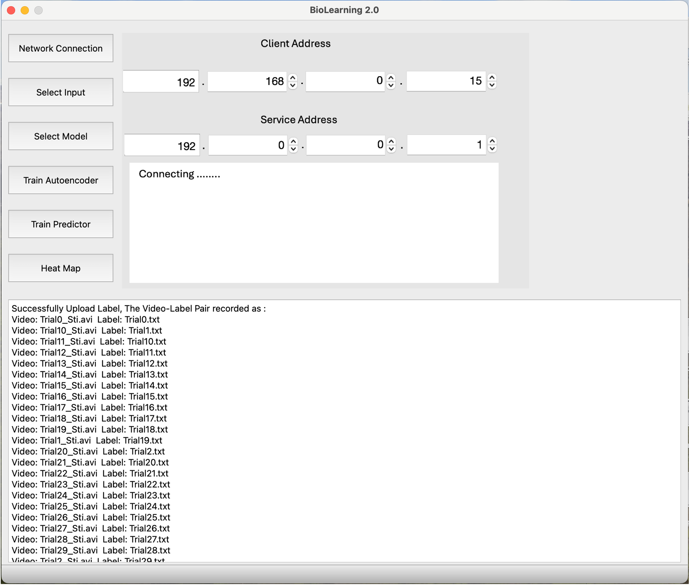
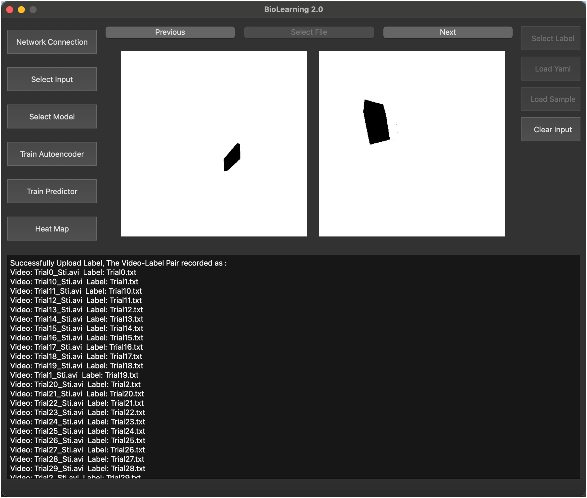
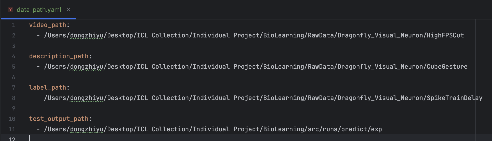
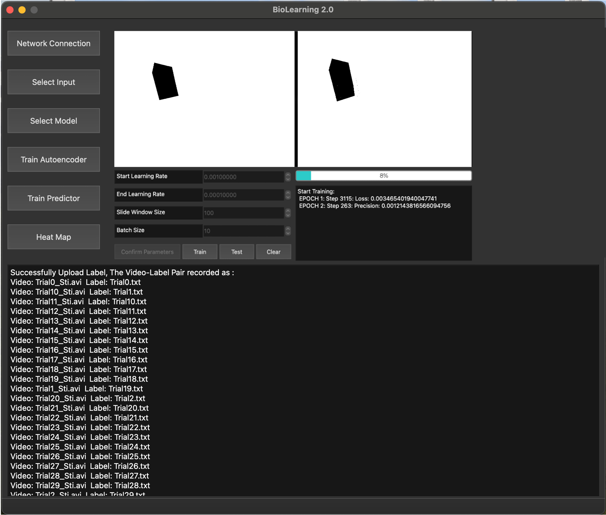
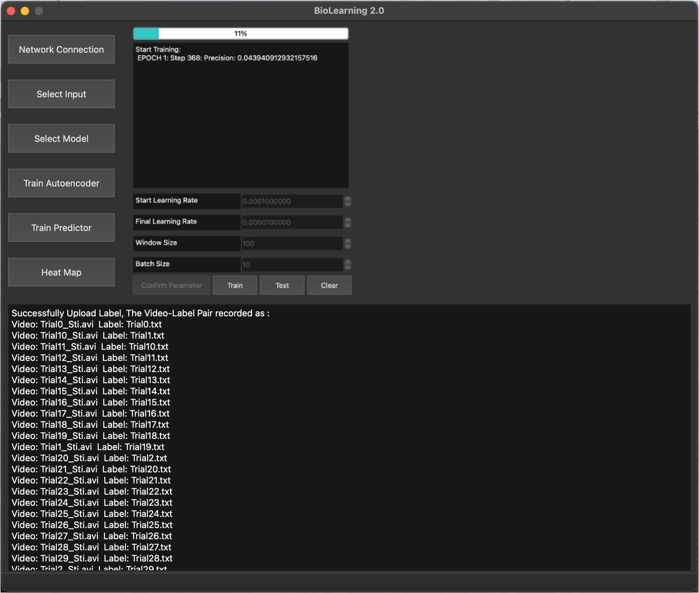
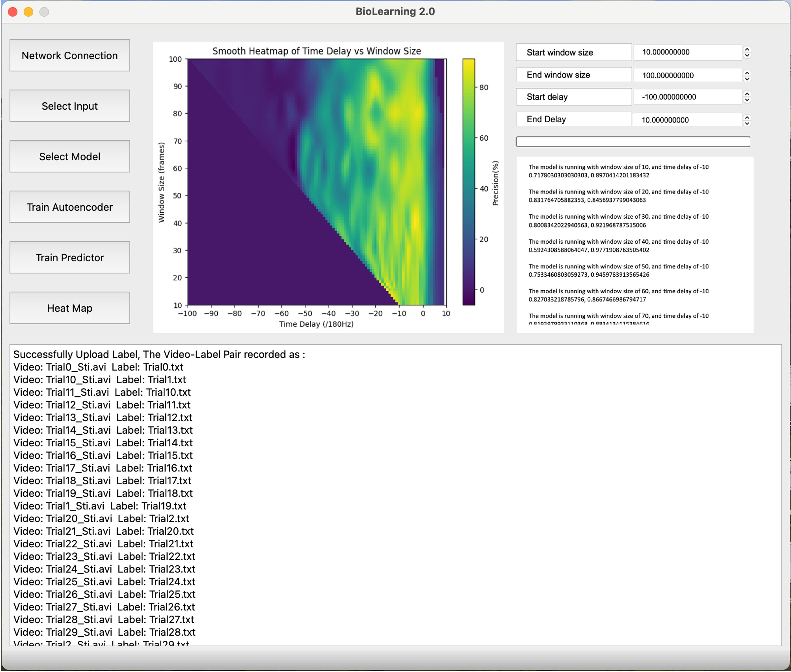

# BioLearning
The individual project for Zhiyu Dong

## Software Installation
1. Download the repository:
```
git clone https://github.com/ZhiyuNoel/BioLearning.git
```
2. Environment Setup: <br>
Change to file Biolearning: /Biolearning
```
pip install -r requirements.txt
```
3. Run software:
   - if you are using the device with MacOS or Linux System, you need to firstly change your branch to macos
     ```
     branch checkout macos 
     python3 main.py
     ```
   - if you are using the device with Window, you need to change the branch to windows
     ```
     branch checkout windows
     python3 main.py
     ```
### Model Training and Customized Algorithm:
1. An more complicate model was separated into another file. You can directly load the model in the software by Button: Load model, but you can also directly run the model:
    - change the path to ClmmCollection:
    ```
    /src/model/ClmmCollection
    python3 trainer.py
    ```
2. Load the sample data for model testing:
    ```
    /src/model
   python3 predict.py
    ```

### Software Specfication:
#### Network Connection in LAN

 Network Connection in LAN shows the user interface(UI) for connecting to other devices within the LAN. This feature provides the user with the ability to remotely call the model training pipeline from server device. The specifications are as follows:
- Widgets: Client Address: Users are requested to type the IP address of client device into text bars separately.
- Widgets: Service Address: Users are requested to type the IP address of server device into text bars separately.
- Window: Connecting log: the connection process is shown here.

#### Select Input:
Select Input shows the user interface for selecting or loading training datasets.

- Button: Select File: When the user clicks on this button, the software will enable the user to access the local file directly by means of a pop-up window. In the pop-up window, the user needs to select the video data to be used in model training. In particular, the software only allows the user to directly select the folder where the video files are located, but not the individual files. Once data loaded, the Select File Button will become non-clickable
- Button: Select Label: If user input data by clicking Select File, this button will be clickable. When the user clicks on this button, the software will provide a pop-up window to enable the user to access the local file directly. In the pop-up window, the user is requested to select the label file path that matches the video data in numbers and names. The label file format is only allowed for .txt files and the user is only allowed to directly select the folder where it is located.
- Button: Load Yaml: The user is allowed to input the data path  by loading a .yaml file directly. In the yaml file, the user needs to indicate the absolute path for video, label, description and output path also. One example of yaml file is shown in \textbf{Figure A.3}.
    yaml example: 
- Button: Load Sample: A quick button for loading example data
- Button: Clear Input: When the user clicks on this button, all previous input data are removed.
- Window: Video Display: This section will play the selected video sequentially after the user selects the video data for the user to confirm whether the videos are selected correctly. This window will play two videos from different video files at a time.
- Button: Previous: After data loaded, this button becomes clickable. When the user clicks on this button, the Video Display window will play the last two video files.
- Button: Next: After data loaded, this button becomes clickable. When the user clicks on this button, the Video Display window will play the next two video files.

#### Select Model:
When the user clicks on the Select Model button on the right, the user interface shown as image will be displayed. This module provides users. This module provides the user with a certain degree of freedom to customise a simple neural network. 

- Button: Default Architectures: In this subpage, the user is allowed to design a simple linear perceptron for some simple tasks. This subpage consists of "Encoder and Decoder Architecture" and "Predictor Architecture". The Input Layer for each is compulsory but the number of input and output nodes could be varied by users themselves. 
- Widgets: Linear Layers/Input Nodes/Output Nodes: The input nodes means the number of feature should be input into linear layers. Especially, the number of input nodes for hidden layers should be the same as the number of output nodes of the previous layer. 
- Button: Load Architecture: The user is allowed to design and load a neuron network by loading a *.cfg file. In the cfg file, the user needs to indicate the necessary hyperparameters for their network. One example of cfg file is shown in \textbf{Figure A.3}.
- Button: Load Model: This software also allows users to use pre-trained model for model training or prediction. When the user clicks on Load model, the software will enable the user to access the local file directly by means of a pop-up window. And then, the user could directly select model file for loading. However, this software only supports pytorch model now. 
- Button: Add One Layer: The user could add one linear hidden layer for encoder/decoder and predictor
- Button: Clear Layers: If the user is not satisfied with their own network, they can click on the this button to clear all hidden layers. 
- Button: Confirm: Once the user have finished their customised neural network, they could click on the Confirm for further task. Once the model is confirmed, the number of layer, the number of input and output nodes are fixed. They could not do any operations on that except clear the network.

#### Train Autoencoder
The autoencoder is an approach for image feature extraction. This subpage is used for varifying the performance of feature extraction. It will show both the raw data that will be used for training, and the results that have been reconstructed from features extracted from raw data.

- Window: Autoencoder Performance: Different with input page, these players will only display images instead of videos. The left player gives the raw image used for feature extraction and the right one show its reconstruction result.
- Widgets: Hyperparameters Control: The user are allowed to do model tuning directly in the software. The hyperparameters control provides functions of learning rate, window size and batch size tuning to satisfy different requirements.
- Button: Confirm Hyperparameters: Once the user confirm a set of hyperparameters for training a model, they can click Confirm Parameter. After that, the value of learning rate, window size and batch size are fixed and not allowed to change in whole training process.
- Button: Train: The button for start training
- Button: Test: The button for start testing
- Button: Clear: The button for reset training process.
- Window: Training Process and Test Result: Progress bars and text boxes show the percentage of training tasks completed and the results produced for each epoch of the training process, respectively.


#### Train Predictor
Image gives an visual demonstration how to use this software to train a single model which could be used to simulate the response of dragonfly's visual neurons. This page basically integrate the whole training pipeline with customised model tuning.

- Widgets: Hyperparameters Control: The user are allowed to do model tuning directly in the software. The hyperparameters control provides functions of learning rate, window size and batch size tuning to satisfy different requirements.
- Button: Confirm Hyperparameters: Once the user confirm a set of hyperparameters for training a model, they can click Confirm Parameter. After that, the value of learning rate, window size and batch size are fixed and not allowed to change in whole training process.
- Button: Train: The button for start training
- Button: Test: The button for start testing
- Button: Clear: The button for reset training process.
- Window: Training Process and Test Result: Progress bars and text boxes show the percentage of training tasks completed and the results produced for each epoch of the training process, respectively.

#### Heat Map
In this page, the user could directly train multiple models with different window size and time delay for searching the optimal parameters. Meanwhile, the performance of each model will be considered as one point in heap map. The heat map will be constructed one point by one point. 

- Window: Heat Map: A visual performance comparison between different models. Each point means the precision score of one model with unique pair of window size and time delay.
- Widgets: Parameters Control: The user could change the range of window size and time delay to determine the searching area and the size of the map.
- Window: Training Process and Test Result: Progress bars and text boxes show the percentage of training tasks completed and the results produced for each model.

## Backend Development
### 日志记录
| 时间        | 目标文件                                                                          | 日志                                                                                  | 状态                                                                                  |
|:----------|:------------------------------------------------------------------------------|:------------------------------------------------------------------------------------|:------------------------------------------------------------------------------------|
| 2024-1-29 | [原始神经网络架构](src/model/network_init.py)                                         | 完成了从BioLearning 1.0 原始架构的重构和重现，并完成模型Autoencoder的训练到测试                               | 重构，并成功完成训练，表现未达到Biolearning 1.0效果                                                   |
| 2024-2-1  | [重构神经网络](src/model/LSTM.py)<br/>[LSTM网络性能测试](src/model/LSTM_test.ipynb)       | 利用LSTM层，和线性层分别构建了LSTM-Linear Autoencoder, Linear Autoencoder 和 CNN-LSTM Autoencoder | Linear Autoencoder 与LSTM-Linear Autoencoder在目前简单的输出环境下表现相较于CNN-LSTM Autoencoder表现更好 |
| 2024-2-4  | [LSTM predictor](src/model/LSTM.py)<br/>[LSTM Pipeline](src/model/predict.py) | 构建，部署LSTM prediction pipeline, 训练当前模型并完成测试                                          | 模型在训练序列上的loss降低至0.1一下，Accuracy 达到95%， precision目前到达40%                              |
| 2024-2-7  | [LSTM predictor](src/model/LSTM.py)<br/>[LSTM Pipeline](src/model/predict.py) | 基本完成对整个序列预测算法的打包与优化，完成了从one-hot list 到 frame index 的输出                              | 模型对整个测试集序列的预测Accuracy达到99.35%，Precision达到86.82%                                     |